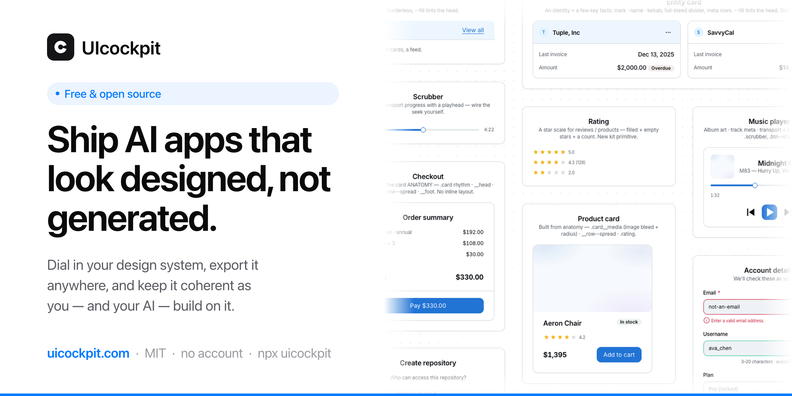

<div align="center">

# UIcockpit

### A design system your AI actually keeps to.

**Dial in your design language visually, export it framework-neutral, and keep it up
to date behind one link — then hand it to your coding agent and `uicockpit check`
makes sure it *stays* on it.** Framework-neutral `--k-*` tokens + 100+ components (real
recipes with state contracts), delivered as a hosted `<link>`, a download, or natively
inside your agent (CLI + MCP).

**Free · no account · paste it anywhere.**

[**Try it →** uicockpit.com](https://uicockpit.com) · [**Use a kit →** kit.uicockpit.com](https://kit.uicockpit.com) · [Docs](https://uicockpit.com/docs)

[](./LICENSE)
[](https://www.npmjs.com/package/uicockpit)
[](https://www.npmjs.com/package/uicockpit-mcp)
[](https://kit.uicockpit.com)




</div>

---

## Why I made this 👋

If you've ever vibe-coded an app, you know the feeling. You're moving fast, the AI is
reaching for the same components for the twentieth time, and somewhere along the way you
lose the thread. The radii drift. The greys don't quite agree. There's always *one*
button that's just… a little off. It all works — but none of it feels like *yours*.

I built UIcockpit to get out of that: a calm place to make the design decisions **once**,
hand them to your agent as a real contract, and have a one-command **check** that catches
the drift before it ships. No spreadsheet of tokens, no hand-tuning forty little things —
a coherent system that survives contact with an AI that builds faster than you can review.

Framework-neutral (plain HTML, Vue, Svelte, React — whatever you're in), free, no account,
no lock-in. — **Alexander**

---

## Where it sits in the stack

Tailwind is *how* you style. shadcn is *what* you assemble. **UIcockpit is the design
language that makes it yours** — and the only layer that *keeps* it coherent as your app
(and your AI) grow. It sits above them, framework-neutral.

| You already have… | which is… | so UIcockpit is… |
|---|---|---|
| **Tailwind / CSS** | *how* you write styles | the **decisions** those styles encode — the layer above |
| **shadcn / Radix** | the **components** (+ behaviour) | the **design language** that makes any components look like one product |
| **Figma / design tokens** | the design **source** (authoring) | the same language, but **executable**, framework-neutral, and **self-enforcing** |

The loop it lives in: **Define** your language → your AI **applies** it →
`uicockpit check` **verifies** it. Not a one-off asset — a layer in the build loop.

→ The thinking behind this: [`VISION.md`](./VISION.md).

---

## 1. Pick a starting point, make it yours

Open [uicockpit.com](https://uicockpit.com), pick one of **7 named styles** grounded in
the best modern apps, then tweak with 19 clear controls:

| Style | Grounded in | Feel |
|---|---|---|
| **Clean** | shadcn / Linear | the balanced default |
| **Precision** | Linear / Figma | crisp, flat, cool |
| **Minimal** | Vercel | mono headings, stark |
| **Refined** | Stripe | ultralight headlines |
| **Calm** | Notion | system font, seamless |
| **Soft** | — | rounded and warm |
| **Editorial** | — | serif headings |

Your brand colour rides through every style. And the engine **keeps it coherent**: pick
any combination of the controls and it straightens the corners that would otherwise look
wrong — a dense layout never gets giant headings, a card always stays visible against the
page, the selected tab is always legible. *Make whatever you want; we straighten it.*

---

## 2. Ship it — two tracks

### 🤖 Agent-native — the check loop (best for AI builds)

Give your coding agent the system **and** the guardrail, no copy-paste:

```bash
npx uicockpit init <kit-hash>   # writes tokens.css + contract.json + AGENTS.md
#  → your agent builds with the --k-* tokens and the house rules
npx uicockpit check --strict    # fails on any drift from the contract — the moat
```

Or run it as an **MCP server** (Claude Code, Cursor, Windsurf, Claude Desktop):

```json
{ "mcpServers": { "uicockpit": { "command": "npx", "args": ["-y", "uicockpit-mcp"] } } }
```

Four tools: **`create_kit`** (generate a kit from a brief — brand, radius, density) ·
**`install_kit`** (pull it into the project) · **`get_design_context`** (the kit's
*grammar* — tokens + component anatomy + composition rules + intent routing) ·
**`check_conformance`** (verify the output). The agent can spin up your language, build on
it, and check itself.

→ [`uicockpit` CLI](./cli/README.md) · [`uicockpit-mcp`](./mcp/README.md)

### 🎨 Web / paste

- **One hosted `<link>`** — the whole kit (tokens + component recipes with real
  hover/focus/disabled states) served from the edge:
  ```html
  <link rel="stylesheet" href="https://kit.uicockpit.com/k/<your-kit-key>.css">
  ```
- **Own the files** — download `tokens.css`, `tokens.json`, a Tailwind v4 `@theme`
  block, or shadcn/ui `globals.css`. No runtime, no dependency.
- **Quick-paste** into v0, Lovable, bolt, … via the in-app **"Use in [your tool]"** router.

---

## What's in the box

- **250+ design tokens** — OKLCH colour ramps (contrast-clamped to WCAG), a type scale
  with weight + label-case control, spacing grid, radii, shadows, a 3-tier motion system,
  a brand-harmonised multi-hue chart/avatar palette.
- **100+ components** — real per-component recipes, all token-driven, all with full
  hover/focus/disabled state contracts, shipped in `tokens.css` and over the CDN.
- **Coherence guarantees** — the foundation self-corrects incoherent control combinations
  (height harmony, surface separation, type-density contrast) and a WCAG contrast check is
  baked in, so the kit you configure is always shippable.
- **Many outputs from one config** — `tokens.css`, `tokens.json`, a Tailwind v4 `@theme`
  block, shadcn/ui `globals.css`, plus the machine-readable `contract.json`, agent rules,
  and a full `design.md` — with a live preview on a real app and a full component gallery:
  change one control, watch the whole thing move.

---

## How it works

One configuration → **one single source** → every surface:

```
19 visual controls ──▶ --k-* tokens ──▶ ┌─ live preview (gallery + a real app that dogfoods the export)
   (Style · Brand · Type ·              ├─ tokens.css / json / Tailwind / shadcn / BRIEF / AI-prompt
    Shape · Surface · Motion)           ├─ hosted kit: kit.uicockpit.com/k/<key>.css
                                        └─ npx uicockpit init/check · the MCP server
```

The CDN runs the exact same function the download uses, so the hosted link is
byte-identical to the file you'd export, and the contract `check` reads always agrees with
the CSS. The demo app renders from the kit alone — if the kit ever breaks, the app breaks
too, and we catch it.

---

## Not a component library — a coherence compiler

A catalog of components is always finite; the agent building your app isn't. Sooner or
later it needs a component you never drew — and it guesses, and the guess drifts off your
language.

So the real product isn't 100 components, or 200. It's the **grammar** underneath them —
the parts and composition rules every component is quietly made of — handed to the agent
through `get_design_context`, with `uicockpit check` making sure that whatever it
assembles, even a screen nobody drew, is built only from *your* language.

A finite kit can, at best, be "complete." A grammar plus a verifier is *generative* — it
covers the screens nobody drew. That's the north star, and the spine is already live:
**configure → CDN → CLI/MCP → check.**

The mechanism has a name: the **Role Canvas**. A small, closed set of roles — *control ·
selectable · surface · tone-bearer · text-slot · overlay* — each guarantees one perceptual
treatment (a height, a selected edge, a legible tint, a truncation…). Any element that tags
a role — through a thin `data-role`, or simply the ARIA state that already names it
(`aria-selected`, `role="menu"`) — **inherits that treatment for free**, so even a component
we never built comes out coherent. It's a set of zero-specificity CSS floors, enforced in
the build, and you can flip it on and off live in the app's loupe.

→ The full thinking lives in [`VISION.md`](./VISION.md).

---

## Run it locally

```bash
git clone https://github.com/alexanderkaan/uicockpit.git
cd uicockpit/cockpit
npm install
npm run dev          # configurator at http://localhost:5173
npm run build        # the build gate (icon-verify → audits → tsc → vite build)
npx vitest run       # tests
```

Vite + React 19 + TypeScript (strict). The CLI (`cli/`) and MCP server (`mcp/`) are
separate zero-dependency packages.

---

## Contributing

Come on in. A new named style, a missing component recipe, an export adapter (Style
Dictionary, Figma variables), a framework adapter, an accessibility fix — all welcome.
Start with [`CONTRIBUTING.md`](./CONTRIBUTING.md) and the
[`Code of Conduct`](./CODE_OF_CONDUCT.md), then open an issue or a discussion.

See [`docs/roadmap.md`](./docs/roadmap.md) for what's shipped, in progress, and next — the
gaps you hit while using it are the best input we get.

---

## Thanks 🙏

If UIcockpit is useful to you, a ⭐ genuinely makes my day and helps other makers find it.

<div align="center">

Made with care by **[Alexander Kaan](https://github.com/alexanderkaan)** at **[Pageminds](https://pageminds.com)** ·
[MIT](./LICENSE), free forever.

</div>
