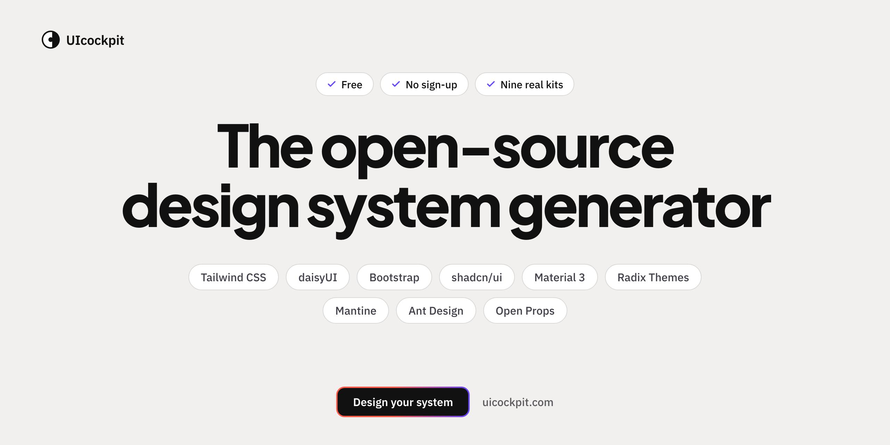

<div align="center">

# UIcockpit

### The open-source design system generator. Nine real UI kits on one screen, in your colours, before you commit to one.

<a href="https://uicockpit.com"></a>

[](./LICENSE)

</div>

---

Pick a starting point, turn the knobs, and watch **Tailwind CSS, daisyUI,
Bootstrap, shadcn/ui, Material 3, Radix Themes, Mantine, Ant Design and Open
Props** render the same screens side by side. One set of values is routed into
each kit's own vocabulary: its variables, its Sass, its tokens, its theme
object. Keep the kit that fits, export the theme, and go build.

Everything runs in the browser. No account, no server, no telemetry. The
export is a zip: `theme.css`, `DESIGN.md` (to Google's design-system spec),
`AGENTS.md`, `CLAUDE.md`, `.cursor/rules`, `install.md` and a `MANIFEST.md`
that lists versions, licences, and what could not be done.

## Nothing here is invented

The claim is not "it looks like Bootstrap". The claim is that it **is**
Bootstrap: their compiled stylesheet, their class names, their components,
read from the package they publish. That claim is enforced, not promised:

- **Fidelity, counted.** Every class the wall emits is looked up in the kit
  that should define it. The meter reads 100 per cent for all eight rendering
  kits, and a class their CSS does not define fails the build by name.
- **Anatomy, verified.** A real class in the wrong nest matches nothing and
  styles nothing, so a rendered sweep asserts that every class on every
  element is reached by at least one rule of its own kit's stylesheet in that
  exact DOM.
- **Behaviour, exercised.** The same sweep re-themes every kit at a second
  brand and asserts that every colour in the brand's hue family follows, that
  nothing painted is invisible against its backdrop, and that every checked
  control renders differently from its unchecked sibling.
- **Gaps, declared.** What a kit has no component for is named on the screen
  and in the manifest, never quietly substituted. Ant Design and Material are
  rendered by their own code; what cannot re-theme live says so.
- **Their icons too.** Tailwind draws Heroicons, Bootstrap draws Bootstrap
  Icons, Material draws Material Symbols, Radix draws Radix Icons, Mantine
  draws Tabler, Ant draws its own set, each read from the package that set
  publishes.

## Run it

Plain Node, zero dependencies of our own:

```bash
cd dsg
npm run kits     # fetch the nine kits from their own published packages
npm run page     # build generator.html, the tool
npm run home     # build home.html, the front page
npm run serve    # serve both locally
```

The gates, if you change anything:

```bash
npm test         # 109 static tests
npm run fidelity # every class, looked up in its kit
npm run sweep    # the rendered sweep: eight kits, two brands, four invariants
npm run exports  # consumer builds: each export compiled by its own kit's tooling
```

## What this deliberately is not

There is no npm package, no CLI and no MCP server for this version. The zip
you export carries the agent-facing files itself, so nothing needs installing
to use what you made. The `uicockpit` and `uicockpit-mcp` packages on npm
belong to a retired earlier version of this project and are deprecated; that
product lives on in this repository at the tag `archive/cockpit-2026-08-17`.

## Also in this repository

[`a2ui/`](./a2ui/README.md) is a sibling experiment: tooling for Google's A2UI
protocol that turns a catalog choice into a renderer you own, with a
conformance verdict on every answer. It has its own README, and
[WHY.md](./WHY.md) holds the positioning it grew from.

## License

[MIT](./LICENSE)
